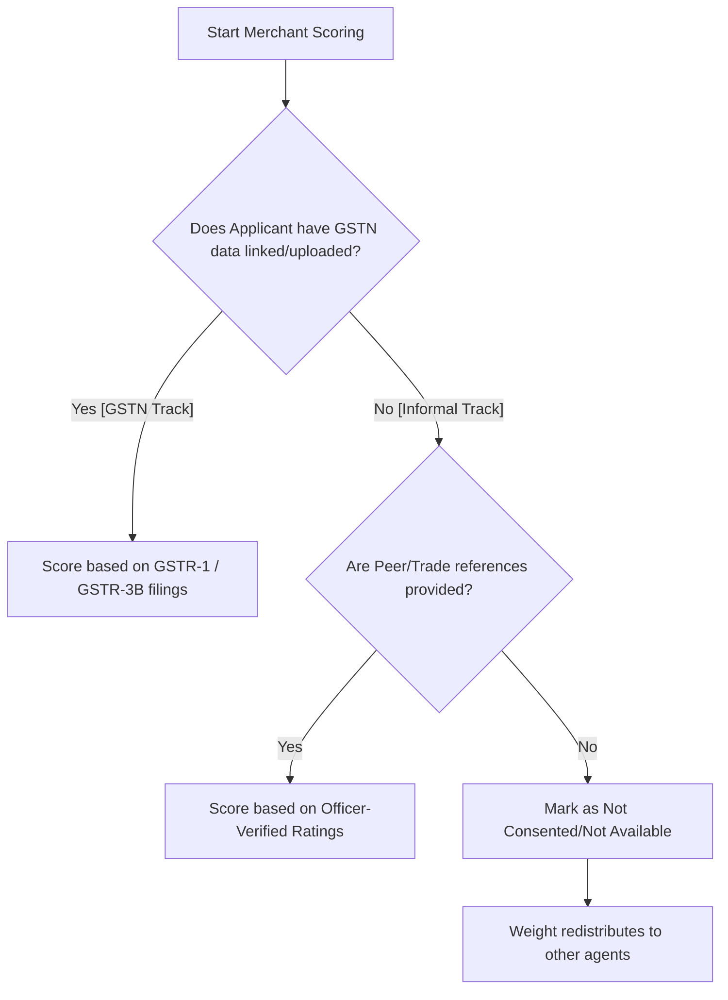

# Architectural Plan — GSTN-Primary & Optional Merchant Agent

This document outlines the analysis, design decisions, and implementation steps to refactor the **`merchant_agent`** from subjective ratings to verified commercial trade data.

---

## 1. Technical Point of View (POV) & Analysis

Your proposal to refactor the `merchant_agent` to **GSTN-primary**, **Self-Reported-Secondary**, and **Optional** solves the core limitations of peer/self-ratings while preserving financial inclusion for MSMEs.

### **Strengths of the Proposed Solution**
1. **Elimination of Gaming/Collusion:** Subjective rating systems (e.g., kirana owner asking friends to rate them 5 stars) are highly vulnerable to manipulation. GSTN invoice data is legally binding and verified via the tax network, representing actual commercial volume.
2. **Credit for Informal Commerce ( Kirana / Mechanic):** For non-GST micro-merchants, keeping trade references as a secondary option allows local reputational capital (which is highly predictive in rural/semi-urban credit) to still be captured.
3. **Weight Elasticity:** Since salaried applicants (e.g. Priya, Ravi) don't have business networks, making this agent optional prevents their overall score from being dragged down by a "0" score. The 5% weight will dynamically re-allocate to their bills, cashflow, and psychometric scores.

### **Redesigned Scoring Architecture**

We will define two tracks for the `MerchantScoringTool`:

#### **Track A: GSTN scoring metrics (0–100 score)**
* **Filing Regularity (40 pts):** Percentage of GSTR-1/GSTR-3B returns filed on-time in the past 12 months.
* **Customer Diversity (30 pts):** Number of unique GSTINs invoiced (recipient counter-parties). (> 15 unique buyers = max points).
* **Invoice Volume Stability (30 pts):** Standard deviation of monthly total invoice value. Low variance or growing invoice volume earns max points.

#### **Track B: Informal Reference-Rating scoring metrics (0–100 score)**
* **Relationship Longevity (40 pts):** Average duration of relationships with supplier/buyer references. (> 3 years = max points).
* **Verification Status (30 pts):** Percentage of reference contacts successfully reached and verified by the bank officer.
* **Averaged Trade Rating (30 pts):** Numerical rating (1-5 scale) provided by the verified references.

---

## 2. Proposed Implementation Plan

### **Phase 1: Database Extensions (SQLite & MongoDB)**
1. **MongoDB Atlas (`database_mongo.py`):**
   * Create a new collection `gstn_filings` to store simulated GST portal downloads or uploaded returns:
     * Fields: `[applicant_id, gstin, business_name, filing_history: [{month, filed_on_time}], invoices: [{recipient_gstin, amount, date}]]`
   * Create a collection `merchant_references` to store offline trade references:
     * Fields: `[applicant_id, reference_name, phone, relationship_type (supplier|buyer), duration_months, verified_status (pending|verified|failed), rating]`
   * Add CRUD helpers and hash dedup checks for uploaded invoices/tax files.

### **Phase 2: API Endpoints (The Dual GST Pathways)**
To allow testing and deployment under both digital-api and manual-document environments, the API will implement two distinct pathways:

1. **Pathway 1 (Digital Link): `POST /api/merchant/simulate-gstn`**
   * Simulates linking the applicant's account with the GST portal.
   * **Parameters:** `[applicant_id, gstin, phone_number]`
   * **Behavior:** Validates GSTIN format, checks applicant status, and seeds realistic GSTR transaction history and filing metrics into MongoDB collection `gstn_filings` directly (resembling a real-time API pull).
2. **Pathway 2 (Document Upload): `POST /api/merchant/upload-gst`**
   * Allows manual upload of tax filing certificates or billing spreadsheets.
   * **Behavior:**
     * Extract text using the common `extract_document_text` utility.
     * Use LLM prompt to validate if the document is a GSTR return or business tax invoice. Rejects utility bills, bank statements, or unrelated documents.
     * Parse structured fields: `[gstin, business_name, total_turnover, invoice_list]`.
     * Persist to MongoDB `gstn_filings`.
3. **Pathway 3 (Informal Trade): `POST /api/merchant/upload-references`**
   * Allows micro-merchants to submit supplier or customer reference lists.
4. **Pathway 4 (Verification): `POST /api/merchant/verify-reference` (Officer Only)**
   * For the bank officer to mark references as verified and record field-verified ratings.

### **Phase 3: Coded Tool Refactoring**
1. **`MerchantScoringTool` (`coded_tools/creditbridge/merchant_tool.py`):**
   * Check if GSTN data exists in MongoDB. If yes, score using Track A (GSTN Filing + Counterparty metrics).
   * Else, check if merchant references exist. If yes, score using Track B (Verified Trade Ratings + Longevity).
   * If neither exists, return `{"status": "not_available"}`.
   * Update the offline synthetic generator `data/synthetic_generator.py` to support deterministic GSTN profiles for demo seeds.

### **Phase 4: Agent & Risk Synthesizer Modifications**
1. **HOCON Topology (`creditbridge.hocon`):**
   * Update `merchant_agent` instructions to narrate whether the score comes from GSTN filings or verified peer references.
   * Modify the frontman (`credit_coordinator`) step instructions:
     * Skip calling `merchant_agent` if the applicant did not consent to/provide merchant data, or if the coded tool reports `not_available`.
2. **Risk Synthesizer Weight Redistribution:**
   * Update `risk_synthesizer`'s normalize-weight routine. If `merchant` is missing from `agent_scores`, its 5% weight is automatically redistributed to the other consented signals.
3. **FastAPI Runner (`agents/runner.py`):**
   * Allow `merchant` to be dynamically omitted from active scoring lists if no references or GSTN link is active, triggering weight redistribution.

---

## 3. Verification Plan

### **Automated Verification Script (`run_merchant_gstn_test.py`)**
A test script will validate both pathways and the scoring calculations:

1. **Digital GSTN Link Test:**
   * Invoke `POST /api/merchant/simulate-gstn` with a mock GSTIN (e.g. `27AAAAA1111A1Z1`).
   * Verify MongoDB collection `gstn_filings` is populated with a 12-month filing regularity structure.
   * Run the coded tool and verify the score is calculated using GSTR compliance rules.
2. **Manual GSTR Invoice Upload Test:**
   * Upload a mock GSTR-1 receipt file to `POST /api/merchant/upload-gst`.
   * Verify the OCR + LLM classifier rejects invalid documents and successfully parses the valid return details.
3. **Optional Agent Weight Redistribution Test:**
   * Run a full scoring pipeline for a standard salaried applicant without GSTN or references.
   * Verify the coordinator omits the `merchant_agent` and the `risk_synthesizer` correctly redistributes its 5% weight to Cashflow and Bill Consistency (bringing total active weight to 100%).
