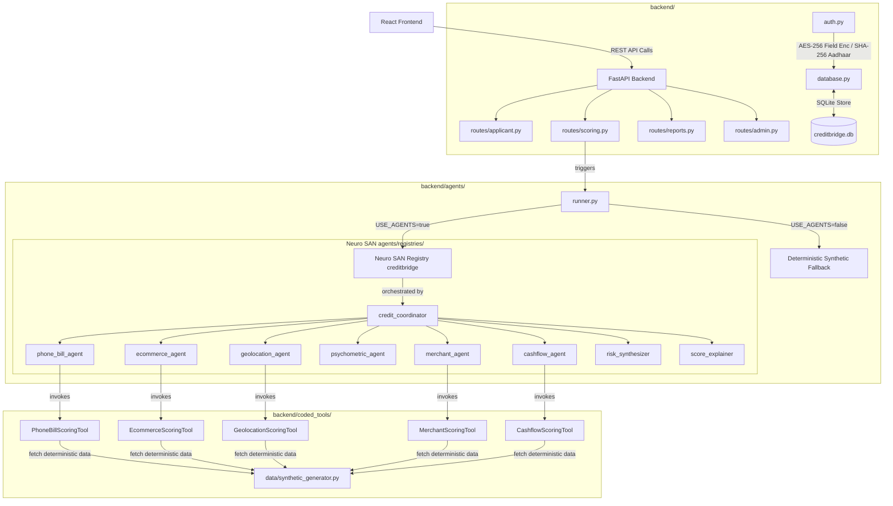

# CreditBridge — Technical Architecture & Alternate Scoring Logic
### PSB Hackathon 2026 | UCO Bank × Department of Financial Services (Ministry of Finance)

CreditBridge is an AI-powered alternate credit scoring system built on the **Neuro SAN** multi-agent framework. It acts as a financial bridge for credit-invisible individuals (such as street vendors, daily wage earners, and home-based workers) who lack a formal bureau (CIBIL) history, enabling them to secure micro-loans from banks.

---

## 1. The Credit Bridge Concept: Solving the CIBIL Catch-22

Traditional bank lending relies heavily on CIBIL scores. However, a CIBIL score requires historical credit/loan repayment data to calculate. This creates a catch-22: **you cannot get a loan without a credit history, and you cannot build a credit history without a loan.** 

According to Indian banking data, millions of hard-working citizens remain "credit-invisible" despite showing financial responsibility in their everyday lives. 

### How CreditBridge acts as a Bridge:
1. **Consent-First Data Aggregation**: The applicant grants consent to share non-bureau alternative data signals.
2. **Behavioral & Data Proxy Processing**: Evaluates 6 everyday data streams representing stability, responsibility, and commercial behavior.
3. **Multi-Agent Evaluation**: Sub-agents evaluate individual data streams, producing sub-scores and human-readable justifications.
4. **Final Scoring Translation**: Synthesizes sub-scores into a single bank-grade credit rating between **300 and 850** with a clear recommendation (loan amount and interest rate).
5. **Secure Bank Integration**: The credit score, audit trail, and raw verification summaries are made available to bank officers for final approval.

---

## 2. System Architecture & Component Mapping

The system follows a modular architecture separating the API routing layer, database encryption, agent registry definitions, and custom data processing tools.



### Important Code Files & Directories:

*   **Network Registry**: [creditbridge.hocon](file:///d:/creditbridge/backend/registries/creditbridge.hocon) — Defines the 9-agent network topology, parameters, instructions, and tools connections.
*   **Agent Runner**: [runner.py](file:///d:/creditbridge/backend/agents/runner.py) — Bridges FastAPI and Neuro SAN. Handles dynamic API key detection and manages automatic fallback.
*   **Scoring Tools**:
    *   [phone_bill_tool.py](file:///d:/creditbridge/backend/coded_tools/creditbridge/phone_bill_tool.py)
    *   [ecommerce_tool.py](file:///d:/creditbridge/backend/coded_tools/creditbridge/ecommerce_tool.py)
    *   [geolocation_tool.py](file:///d:/creditbridge/backend/coded_tools/creditbridge/geolocation_tool.py)
    *   [merchant_tool.py](file:///d:/creditbridge/backend/coded_tools/creditbridge/merchant_tool.py)
    *   [cashflow_tool.py](file:///d:/creditbridge/backend/coded_tools/creditbridge/cashflow_tool.py)
*   **Security & Database**:
    *   [database.py](file:///d:/creditbridge/backend/database.py) — Database tables, audit logs, admin-configurable weights, and connection managers.
    *   [auth.py](file:///d:/creditbridge/backend/auth.py) — Cryptography helper library derivation, JWT generation, password verification, and Aadhaar hashing.
    *   [config.py](file:///d:/creditbridge/backend/config.py) — Global settings, model routing definitions, and default score bands.
*   **API Routes**:
    *   [applicant.py](file:///d:/creditbridge/backend/routes/applicant.py) — Handles applicant registration, DPDP-compliant consent recording, and psychometric questionnaire submissions.
    *   [scoring.py](file:///d:/creditbridge/backend/routes/scoring.py) — Triggers execution, collects sub-scores, compiles outputs, and updates database records.
    *   [reports.py](file:///d:/creditbridge/backend/routes/reports.py) — Serves bank dashboard views and audit log trails.
    *   [admin.py](file:///d:/creditbridge/backend/routes/admin.py) — Provides endpoints for weight adjustments and dashboard analytics.

---

## 3. Sub-Agent Scoring Formulas & Calculations

Each sub-agent scores its respective alternate channel out of 100 points based on predefined deterministic rules (implemented in [synthetic_generator.py](file:///d:/creditbridge/backend/data/synthetic_generator.py)):

### 1. Phone Bill Agent (`phone_bill_agent`)
Evaluates bill payment discipline as a proxy for recurring financial commitments.
*   **Inputs**: `months_of_history`, `on_time_payments`, `late_payments`, `disconnections`.
*   **Formula**:
    $$\text{Base Score} = \left( \frac{\text{on\_time\_payments}}{\text{months\_of\_history}} \right) \times 100$$
    $$\text{Score} = \text{Base Score} - (\text{disconnections} \times 15) - (\max(0, \text{late\_payments} - 2) \times 5)$$
    *   *Bonus*: If history is > 24 months, add 10 points.
    *   *Constraint*: Clamped to $[0, 100]$.

### 2. E-commerce Agent (`ecommerce_agent`)
Evaluates purchase behavior and financial discipline.
*   **Inputs**: `payment_method`, `return_rate_percent`, `account_age_months`, `avg_order_value`, `orders_per_month`.
*   **Formula**: Starts with a base of 40 points.
    *   *Payment Method*: $+20$ points for Prepaid; $+10$ points for Mixed; $+0$ points for cash-on-delivery (COD).
    *   *Return Rate*: $+15$ points if return rate $< 10\%$; $+5$ points if return rate $< 20\%$.
    *   *Account Loyalty*: $+10$ points if account age $> 12$ months.
    *   *Average Order Value*: $+10$ points if avg order is ₹500 - ₹2000; $+5$ points if order value $> ₹2000$.
    *   *Frequency*: $+10$ points if orders/month $\ge 3$; $+5$ points if orders/month $\ge 1.5$.
    *   *Constraint*: Clamped to $[0, 100]$.

### 3. Geolocation Agent (`geolocation_agent`)
Evaluates stability, flight risk, and community root depth.
*   **Inputs**: `home_location_stability_months`, `work_location_stability_months`, `distance_home_to_work_km`, `area_type`, `frequent_travel`.
*   **Formula**: Starts with 0 points.
    *   *Home Stability*: $+40$ points if $\ge 24$ months; $+30$ points if $\ge 12$ months; $+15$ points if $\ge 6$ months.
    *   *Work Stability*: $+30$ points if $\ge 12$ months; $+20$ points if $\ge 6$ months; $+10$ points otherwise.
    *   *Commute distance*: $+10$ points if distance home-to-work $< 10$ km.
    *   *Location Type*: $+10$ points for Urban; $+5$ points for Semi-urban.
    *   *Travel Frequency*: $+10$ points if no frequent travel.
    *   *Constraint*: Clamped to $[0, 100]$.

### 4. Psychometric Agent (`psychometric_agent`)
Assesses integrity, financial planning mindset, and loan repayment responsibility.
*   **Inputs**: Array of 10 questionnaire answers (each index 0 to 3, where 0 represents the most responsible option).
*   **Formula**: Maps each question response to an explicit scoring array:
    *   $Q_1$ (Repayment timing): `[100, 85, 65, 50]`
    *   $Q_2$ (Unexpected expenses): `[100, 80, 55, 40]`
    *   $Q_3$ (Loan attitude): `[90, 70, 60, 85]`
    *   $Q_4$ (Savings cushion): `[100, 80, 60, 30]`
    *   $Q_5$ (Promise keeping): `[100, 80, 50, 20]`
    *   $Q_6$ (Responsibility): `[100, 75, 60, 20]`
    *   $Q_7$ (Savings consistency): `[100, 80, 55, 25]`
    *   $Q_8$ (Promise keeping behavior): `[100, 80, 50, 15]`
    *   $Q_9$ (Loan target/purpose): `[100, 80, 60, 70]`
    *   $Q_{10}$ (Debt mindset): `[100, 70, 80, 50]`
    *   *Result*: Average of scores derived from answered questions, clamped to $[0, 100]$.

### 5. Merchant Agent (`merchant_agent`)
Assesses business trust networks for small-scale merchants.
*   **Inputs**: `total_merchants_rated`, `average_rating`, `years_of_merchant_relationships`, `payment_consistency_rating`.
*   **Formula**:
    *   *No Data*: If total rated is 0, returns a neutral score of $50$.
    *   *Average Rating*: $+50$ points if rating $\ge 4.5$; $+35$ points if $\ge 3.5$; $+20$ points if $\ge 2.5$; $+5$ points otherwise.
    *   *Merchant Breadth*: $+20$ points if $\ge 10$ merchants; $+15$ points if $\ge 5$ merchants; $+10$ points if $\ge 2$ merchants.
    *   *Stability*: $+20$ points if relationships $\ge 3$ years; $+10$ points if $\ge 1$ year.
    *   *Consistency*: $+10$ points for Excellent; $+5$ points for Good.
    *   *Constraint*: Clamped to $[0, 100]$.

### 6. Cashflow Agent (`cashflow_agent`)
Assesses direct liquidity and savings habits.
*   **Inputs**: `has_bank_account`, `account_type`, `avg_monthly_balance`, `credit_regularity`, `bounced_transactions`, `savings_behavior`.
*   **Formula**:
    *   *Unbanked*: If bank account is missing, returns baseline score of $40$.
    *   *Banked*: Starts with base of 20 points.
    *   *Credits*: $+30$ points if credits are Regular.
    *   *Balance*: $+20$ points if balance $\ge ₹10,000$; $+15$ points if $\ge ₹5,000$; $+8$ points if $\ge ₹1,000$.
    *   *Transaction bounces*: $+20$ points if bounces $= 0$; $+10$ points if bounces $\le 2$.
    *   *Savings Attitude*: $+10$ points for Saves regularly; $+5$ points for Occasional.
    *   *Constraint*: Clamped to $[0, 100]$.

---

## 4. Final Score Synthesis & Weight Redistribution

Once the sub-scores are collected, the `risk_synthesizer` runs.

### Default System Weights
By default, the categories contribute to the score with these weights:
*   **Phone Bill**: $25\%$ ($0.25$)
*   **Cashflow**: $20\%$ ($0.20$)
*   **Psychometric**: $20\%$ ($0.20$)
*   **Geolocation**: $15\%$ ($0.15$)
*   **E-commerce**: $12\%$ ($0.12$)
*   **Merchant**: $8\%$ ($0.08$)

### DPDP Compliance via Dynamic Weight Redistribution
> [!IMPORTANT]
> Under India's Digital Personal Data Protection (DPDP) Act, applicants have the right to refuse sharing certain personal databases (e.g. they might choose not to share their E-commerce transactions or Cashflow records). 
> To ensure they are not penalized with a score of 0 for those categories, **CreditBridge dynamically redistributes weights.**

1. Identify active data sources based on consent.
2. Sum the default weights of active sources: $W_{total} = \sum W_{active}$.
3. Normalize each active weight: $W'_{i} = \frac{W_i}{W_{total}}$.
4. Calculate Weighted Average: $\text{Avg} = \sum (\text{Score}_i \times W'_{i})$.
5. Translate to Credit Score:
   $$\text{Final Credit Score} = \text{round}\left( 300 + \frac{\text{Avg}}{100} \times 550 \right)$$
   *(Clamped strictly between $300$ and $850$)*.

### Risk Categories & Bank Recommendations
The system matches the final score against 5 risk categories to output loan recommendations:

| Score Range | Risk Category | Decision | Max Loan Recommendation | Interest Rate |
| :--- | :--- | :--- | :--- | :--- |
| **750 - 850** | Low Risk | Pre-approved | ₹5,00,000 | $10.5\%$ |
| **650 - 749** | Low-Medium Risk | Approved | ₹3,00,000 | $12.0\%$ |
| **550 - 649** | Medium Risk | Conditional Approval | ₹1,00,000 | $15.0\%$ |
| **450 - 549** | Medium-High Risk | Careful Review Required | ₹50,000 | $18.0\%$ |
| **300 - 449** | High Risk | Not Recommended | ₹0 | $0.0\%$ |

---

## 5. Security & Privacy Safeguards (Data Protection)

To comply with banking standards and privacy requirements, several safeguards are implemented directly:

1.  **PII Encryption (AES-256)**: Personal Identifiable Information like email addresses and phone numbers are encrypted before storing in the database using Fernet symmetric encryption.
2.  **One-way Aadhaar Hashing (SHA-256)**: Instead of storing Aadhaar numbers (which violates UIDAI guidelines without an authorized vault), the system hashes the last 4 digits of Aadhaar using a custom salt:
    $$\text{Hash} = \text{SHA256}(\text{"creditbridge-aadhaar-" + AadhaarLast4 + "-salt"})$$
    This allows matching applicant profiles without storing sensitive identification numbers.
3.  **Immutable Audit Trails**: The `consent_logs` and `audit_log` tables track all actions. Every consent update (granting or revoking access) logs a record to ensure complete compliance traceability.

---

## 6. Command Results & Test Outputs

### Test Suite Execution Output (`test_agents.py`)
Executing `test_agents.py` verifies both the coded tools imports and correctness of calculation outputs across diverse scoring profiles:

```text
============================================================
  CreditBridge -- Full Pipeline Verification
============================================================

============================================================
Test 1 — Coded Tool Imports & Invocations
============================================================
  ✓ PhoneBillScoringTool           score=56  status=success
  ✓ EcommerceScoringTool           score=60  status=success
  ✓ GeolocationScoringTool         score=45  status=success
  ✓ MerchantScoringTool            score=65  status=success
  ✓ CashflowScoringTool            score=40  status=success

  Result: ✓ All tools OK

============================================================
Test 2 — Scoring Pipeline (SYNTHETIC (no LLM))
============================================================

  Applicant: Priya Sharma (High scorer — all data)
  ID:        demo-priya-002
  Consented: ['phone_bill', 'ecommerce', 'geolocation', 'merchant', 'cashflow']
  Score:     635/850
  Risk:      Medium Risk
  Loan:      Rs 100,000
  Rate:      15.0%
  Mode:      synthetic
  Expected:  580-850
  Result:    ✓ PASS

  Applicant: Ravi Kumar (Mid scorer — partial data)
  ID:        demo-ravi-001
  Consented: ['phone_bill', 'geolocation', 'merchant']
  Score:     685/850
  Risk:      Low-Medium Risk
  Loan:      Rs 300,000
  Rate:      12.0%
  Mode:      synthetic
  Expected:  550-750
  Result:    ✓ PASS

  Applicant: Mohammed Ishaq (Low scorer — minimal data)
  ID:        demo-ishaq-003
  Consented: ['phone_bill', 'geolocation']
  Score:     495/850
  Risk:      Medium-High Risk
  Loan:      Rs 50,000
  Rate:      18.0%
  Mode:      synthetic
  Expected:  350-600
  Result:    ✓ PASS

============================================================
Overall: ✓ ALL TESTS PASSED
============================================================
```

### CLI Scoring Pipeline Execution Output (`run_credit_check.py`)
Executing `run_credit_check.py --id demo-priya-002 --agents` runs the evaluation in full multi-agent mode (utilizing Neuro SAN + Mistral API):

```text
════════════════════════════════════════════════════════════
  CreditBridge Terminal Runner  |  NEURO SAN + Mistral LLM
════════════════════════════════════════════════════════════

  Scoring: demo-priya-002 ...

  Applicant : Priya Sharma (Lucknow)
  Profile   : Street vendor, 2 years phone payments, Flipkart buyer
  Mode      : neuro_san
  Time      : 65.2s

  CREDIT SCORE : 583 / 850
  [████████████████████░░░░░░░░░░░░░░░░░░░░]
  300          425          550          675          850

  Risk Band : Medium Risk
  Decision  : Conditional
  Max Loan  : Rs 100,000
  Rate      : 15.0%

  Signal Breakdown:
────────────────────────────────────────────────────────────
  phone_bill       51/100  [██████████░░░░░░░░░░]
                  Base score 80.8, minus 30 for 2 disconnections, minus 5
  ecommerce        70/100  [██████████████░░░░░░]
                  Account age over 12 months (+10), average order value a
  geolocation      55/100  [███████████░░░░░░░░░]
                  Home stability (11 months: +30), work stability (6 mont
  psychometric    100/100  [████████████████████]
                  Perfectly consistent and highly responsible financial m
  merchant         55/100  [███████████░░░░░░░░░]
                  Average rating 2.7 (base 20) + 15 for 6 merchant relati
  cashflow         40/100  [████████░░░░░░░░░░░░]
                  No bank account — minimum baseline applied
────────────────────────────────────────────────────────────

  Explanation:
  Your credit score is 583 out of 850, placing you in the 
  Medium Risk band. You are eligible for a loan of 
  ₹1,00,000 at a 15% interest rate, but approval will 
  depend on further checks. Your top strengths are your 
  ecommerce activity and psychometric score. Your ecommerce 
  account is over 12 months old and you place more than 1.5 
  orders per month, showing regular and responsible 
  spending. Your psychometric score is perfect, meaning you 
  have a very responsible financial mindset. To improve, 
  focus on your phone bill and cashflow. Pay your phone 
  bill on time every month to avoid disconnections and late 
  fees. Open a bank account to start building a cashflow 
  history, which will help lenders see your income and 
  spending patterns. 

  Saved   -> D:\creditbridge\backend\results\demo-priya-002_20260623_075042.json
```

---

## 7. Project Progress & Roadmap

### What has been Accomplished:
*   **Dynamic Multi-Agent Orchestration**: Successfully mapped and verified a 9-agent network registry (`creditbridge`) in HOCON.
*   **Dual Execution Mode**: Implemented a reliable runtime bridge ([runner.py](file:///d:/creditbridge/backend/agents/runner.py)) that defaults to a synthetic scoring calculation fallback when LLM API keys are absent or rate-limited.
*   **Secure Storage Architecture**: Complete implementation of AES-256 field encryption and salted Aadhaar hashes in SQLite database.
*   **FastAPI REST Integration**: Developed and verified backend endpoints for applicant registry, consent, scoring, and dashboard reports.
*   **CLI Verification tools**: Maintained unit testing and manual check scripts for terminal execution.

### Next Steps for Project Completion:
1.  **API Integrations (Production Scrapers)**: Replace the synthetic database connector tools in `coded_tools/` with mock REST calls to telecom services (Jio/Airtel API sandbox) and GST portal APIs.
2.  **Consent revoking testing**: Verify on the UI that revoking consent correctly updates the database and triggers dynamic weight recalculation instantly.
3.  **Human-in-the-Loop Override Panel**: Develop dashboard UI features enabling Bank Officers to override score-based credit recommendations (e.g. manually approving a Medium-High Risk applicant based on custom offline details).
4.  **Aadhaar OTP Integration**: Incorporate a simulated Aadhaar OTP verification popup flow on signup.
